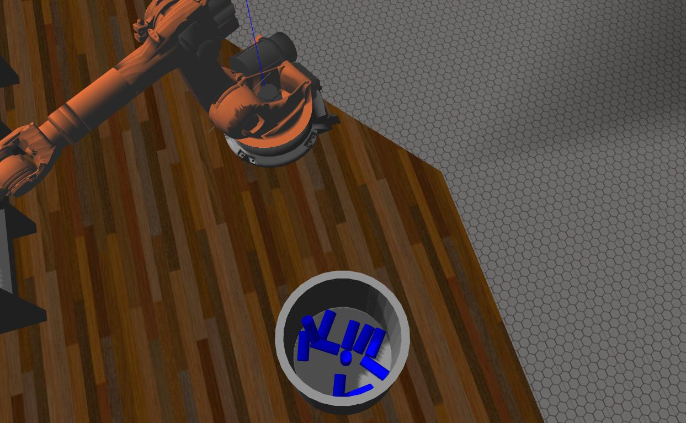

## Project: Robotic Arm Pick &amp; Place
____

### Full Write-up can be found [here](./Writeup.ipynb)
This implementation of the Pick &amp; Place project was ran on a Ubuntu 16.04 device with the following specifications:

    Memory: 7.7 GiB
    Processor: Intel Core i7-3537U CPU @ 2.00GHz x 4
    Graphics: Intel Ivybridge Mobile
    OS Type: 64-bit

The objective of the project was to calculate and implement in code the inverse kinematics
of an industrial manipulator, in closed-form using the Geometric method.

 

#### Structure of the project:

Modification were made to the files provided by Udacity and additional files were added to make the structure of the project more consistent.
All the files and their content is described below:

- [*kuka_arm/scripts/IK_server.py*](./kuka_arm/scripts/IK_server.py) [new]: Contains the ROS node used to provide the IKCalculation service.

- [*kuka_arm/scripts/kr210_kinematics/\__main\__.py*](./kuka_arm/scripts/kr210_kinematics/__main__.py) [from udacity]: Contains the IK_debug.py code modified to work with the rest of the package. Allows to call the package more easily from the command line via 'python -m kr210_kinematics'
- [*kuka_arm/scripts/kr210_kinematics/forward_kinematics.py*](./kuka_arm/scripts/kr210_kinematics/forward_kinematics.py) [new]: Contains the code to generate all relevant transforms for the Forward Kinematics of our manipulator.

- [*kuka_arm/scripts/kr210_kinematics/inverse_kinematics.py*](./kuka_arm/scripts/kr210_kinematics/inverse_kinematics.py) [new]: Provides the actual implementation of the IK, used by the IK_server to execute the IK calculations. 

- [*kuka_arm/scripts/kr210_kinematics/utils.py*](./kuka_arm/scripts/kr210_kinematics/utils.py) [new]: Contains the Sympy symbols and helper methods used in the package. Also contains the Denavit Hartenberg table as a dictionary of symbols. 

- [*kuka_arm/launch/inverse_kinematics.launch*](./kuka_arm/launch/inverse_kinematics.launch) [from udacity]: Two params were added to allow to toggle IK debugging when the robot is live. 

- [*media/\*.jpg*](./media/) [new]: Contain video and screenshot from Gazebo. 

- [*notebook/\*.ipynb*](./notebook/) [new]: Contain Inverse Orientation solution in Sympy and notebook version of this writeup.

- [*writeup_notes/\*.jpg*](./writeup_notes/) [new]: Contain graphs and details of the IK calculations. 

